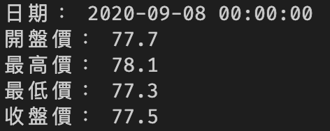
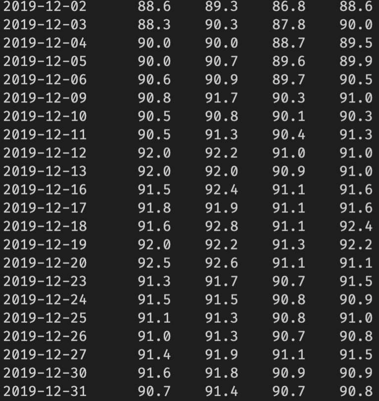
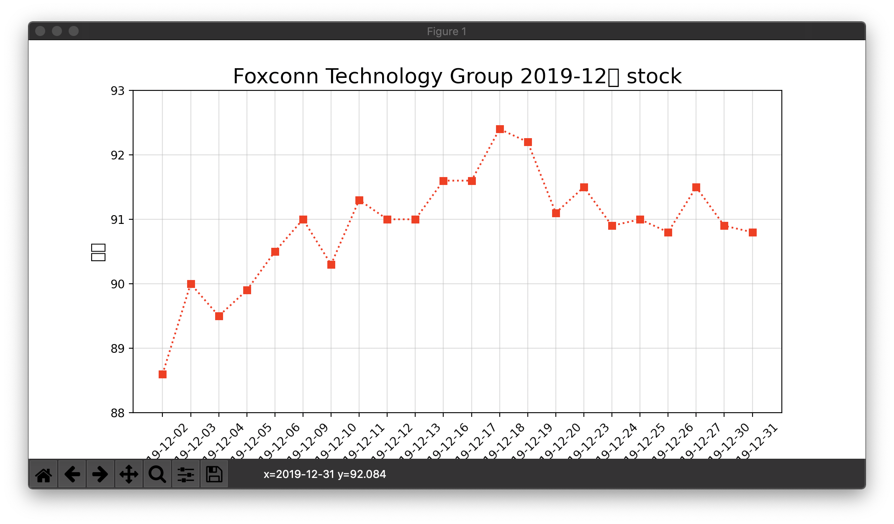

# 即時股市爬取

twstock台灣股市專用模組抓取即時股價，並實現視覺化

# twstock 套件使用
pip install twstock 

# 屬性：
1. date / 日期
2. capacity / 交易股數(單位：股)
3. turnover / 交易金額(單位：元)
4. open / 開盤價
5. high / 最高價
6. low / 最低價
7. price / 收盤價
8. close / 收盤價
9. change / 漲跌差價
10. transaction / 交易筆數
 

# 視覺化 與 資料呈現
1. 數據

2. 視覺化

